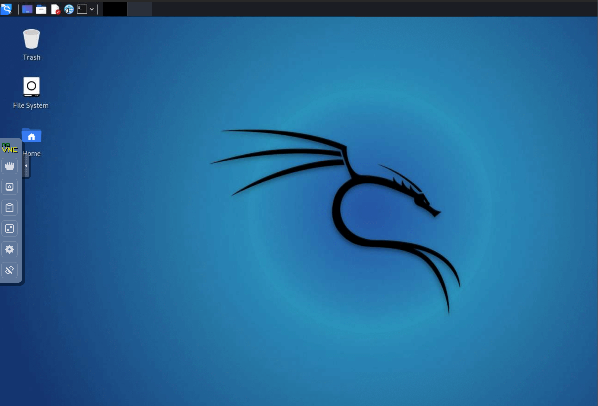
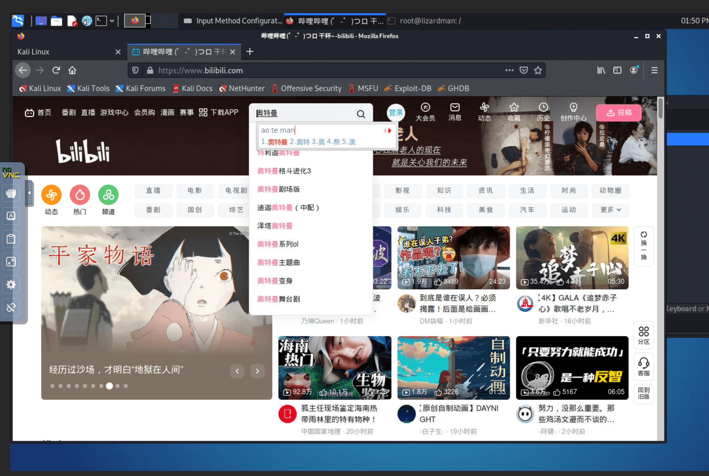

## 支持的功能

- ssh，可以直接通过 ssh 远程连接 kali
- tightvnc+noVNC / x11vnc+noVNC ：可以通过 vnc client 连接 kali
- xrdp：可以通过 rdp 协议连接进入 kali
- 可以 kali 中直接使用 firefox 浏览器（默认容器中是不支持直接使用浏览器的，会崩溃）
- 已安装 google-pinyin 中文输入法（输入法还有点小问题，还需要修复）

## 密码和端口

- ssh 在 k8s 中的 nodePort 端口默认为 30022/tcp，默认密码为 `toor`
- noVNC 在 k8s 中的 nodePort 端口默认为 30081/tcp，默认密码为 `toor`
- xrdp 在 k8s 中的 nodePort 端口为 31389/tcp，默认用户名为 `root`，密码为 `toor`

## 截图

